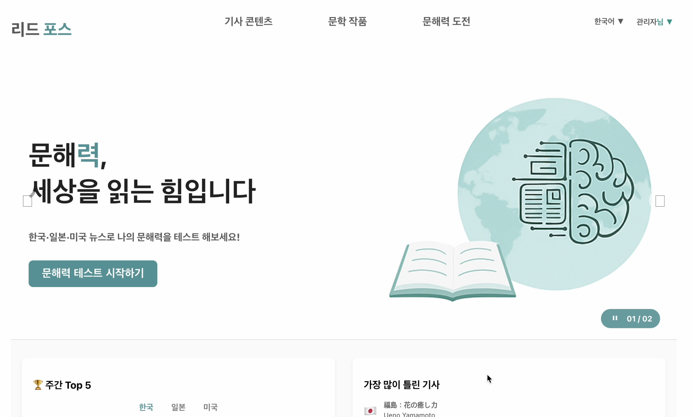
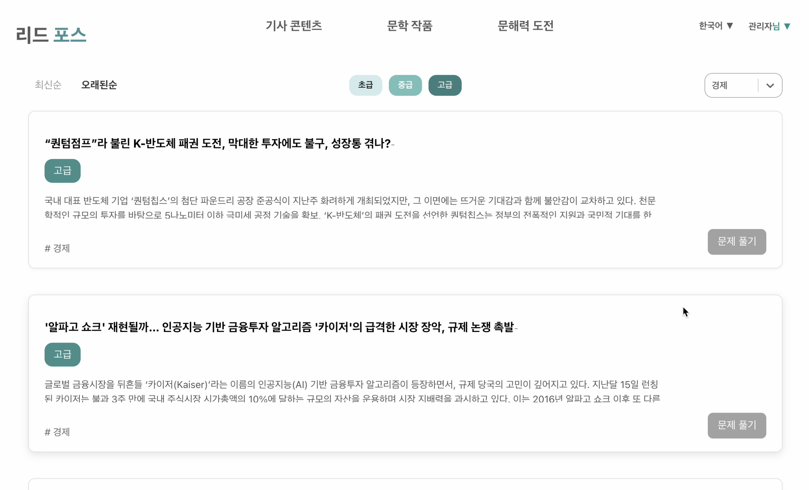
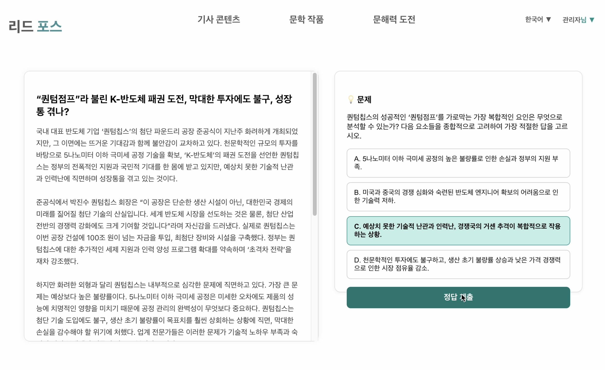
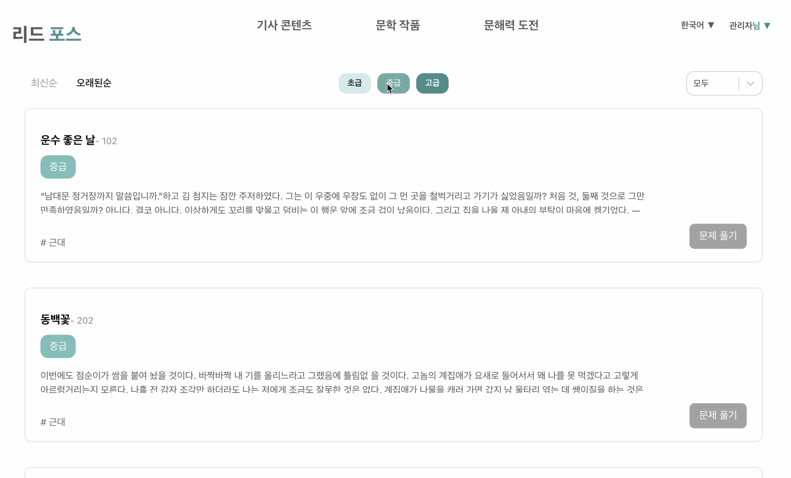
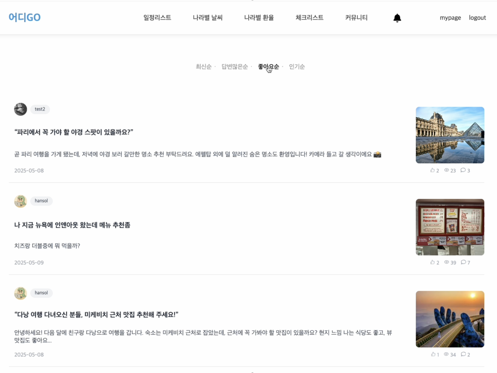
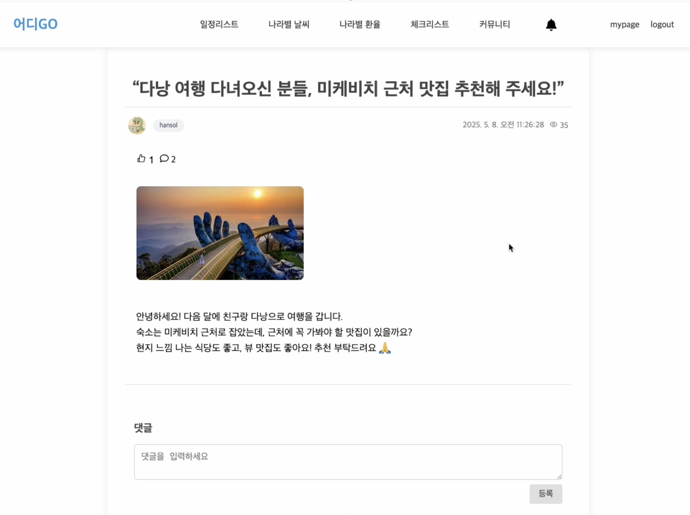
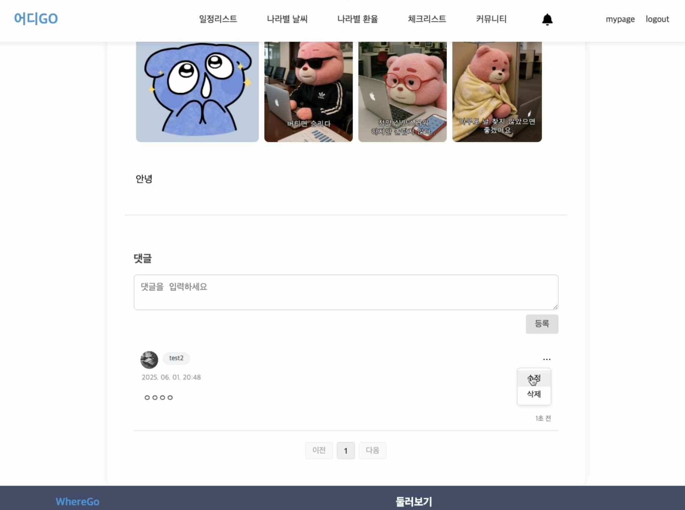

# 👩🏻‍💻 Hansol Choi's Portfolio

안녕하세요! 프론트엔드 개발자 **최한솔**입니다.  
문해력 향상 웹 서비스, 여행 일정 추천 플랫폼, 오프라인 채팅 앱 등 다양한 분야의 프로젝트를 통해  
**사용자 중심의 UI/UX**, **상태 관리 및 API 연동**, **컴포넌트 구조 설계** 능력을 키웠습니다.

---

## 🔗 주요 프로젝트

### 1. [📚 ReadForce - 문해력 향상 웹 서비스](https://github.com/hansol04/ReadForce)

> 뉴스·문학 기반 문해력 진단 및 향상 웹 서비스

- **설명**: AI 기반 뉴스·문학 문제를 풀며 문해력을 진단하고, 적응형 학습을 통해 실력을 향상시키는 웹 서비스입니다.
- **주요 기능**: 기사/문학 학습, 실력 테스트, 적응형 문제 추천, 랭킹 시스템, 마이페이지, 관리자 페이지
- **Frontend**: React 
- **역할**: 전체 UI 및 UX 흐름 구성, 기사/문학/동화 목록 및 상세 페이지 구현, 난이도·카테고리 필터, 문제 풀이 페이지, 결과 페이지 UI/로직

---

### 2. [✈️ WhereGo - 여행 일정 추천 플랫폼](https://github.com/hansol04/WhereGo)

> 여행지 등록부터 커뮤니티까지, 일정 계획을 도와주는 여행 플랫폼

- **설명**: 사용자가 직접 여행지를 등록하고, 리뷰와 정보를 공유하며 일정을 관리할 수 있는 플랫폼입니다.
- **주요 기능**: 여행지 등록/수정/삭제, 일정 관리, 커뮤니티, 체크리스트, 마이페이지, 환율 계산기, 지도 API
- **Frontend**: React 
- **역할**: 여행 일정 기록 및 커뮤니티 게시판(글작성, 댓글, 썸네일, 사진 추가/삭제, 검색, 인기게시물, 권한 제어) 구현

---

### 3. [📡 Sodam - 블루투스 기반 채팅 & 게임 앱](https://github.com/hansol04/Sodam)

> 데이터 없이도 즐기는 오프라인 채팅과 게임, 리워드 기반 모바일 앱

- **설명**: Wi-Fi 없이도 블루투스로 1:1/그룹 채팅과 미니게임을 즐길 수 있는 모바일 앱입니다. (※ 블루투스 기능 미완성)
- **주요 기능**: 사용자 기능, 게임, 리워드 시스템, 상점 및 커스터마이징, 마이페이지
- **Frontend**: Flutter (Dart)
- **역할**: 전체 UI 및 UX 흐름 구성, 인트로/온보딩, 로그인/회원가입/비회원, 채팅, 방 만들기, 게임 UI, 리워드 시스템

---

## 💬 About Me

- 프론트엔드 중심의 개발 역량 강화 중 (React / Flutter)
- 사용자 경험을 최우선으로 고려한 화면 설계 및 기능 개발 경험 다수
- GitHub, Notion, Figma를 활용한 협업과 문서화 경험 보유

---

## 📫 Contact

- GitHub: [hansol04](https://github.com/hansol04)  
- Email: gksthf0428@naver.com
