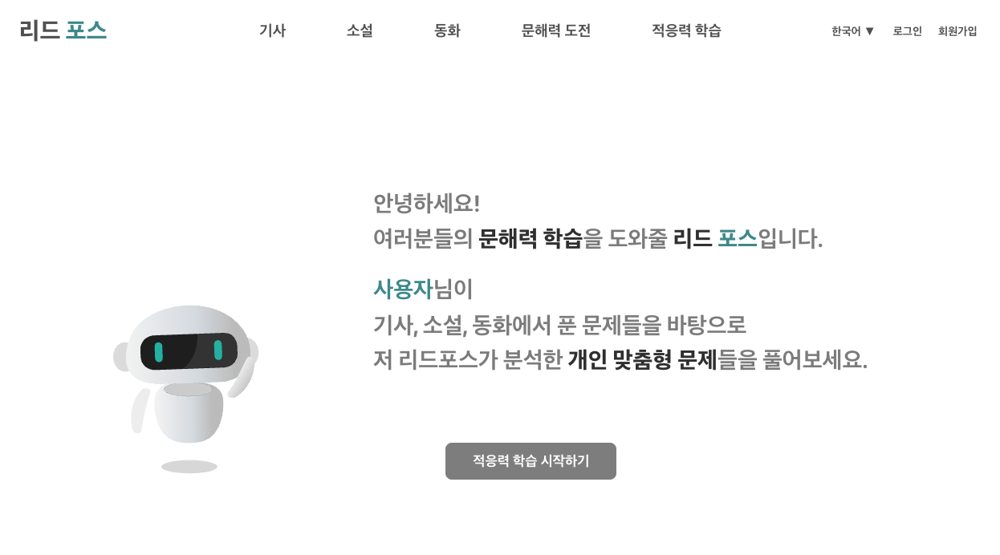
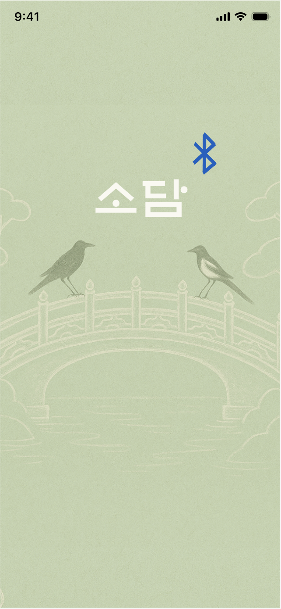

# 👩🏻‍💻 Hansol Choi's Portfolio

안녕하세요! 주니어 웹 개발자 최한솔입니다.  
React 기반의 UI 구현 경험을 바탕으로 풀스택 개발자로 성장 중입니다.

- 사용자 중심의 UI/UX, 상태 관리, API 연동 등 **프론트엔드 전반을 직접 구현**한 경험이 있습니다.  
- 디자인 시안 없이도 **Figma로 UI를 설계하고**, React/Flutter로 퍼블리싱과 기능 구현을 주도했습니다.  
- **실제 프로젝트에서 전체 화면 흐름과 기능 구조를 직접 구성**하며 실무 역량을 다졌습니다.

현재는 Java와 Spring Boot 기반 백엔드 구조를 학습 중이며,  
- 부트캠프에서 관련 수업을 이수했고  
- 김영한의 Java/Spring 강의 시리즈로 이해도를 확장하고 있습니다.

서비스 전체 흐름을 고려하는 **균형 잡힌 개발자**를 목표로 성장하고 있습니다.

---

## 🔗 주요 프로젝트

### 1. [📚 ReadForce - 문해력 향상 웹 서비스](https://github.com/hansol04/ReadForce)

> 🏆 **우수상 수상작 – K-디지털 트레이닝 SW 잡-브릿지 Day 발표회**  
> (서울지방고용노동청 × 메인비즈협회 주관)

> 뉴스·문학 기반 문해력 진단 및 향상 웹 서비스
> https://www.youtube.com/watch?v=_i8pubnEbZA

- **설명**: AI 기반 뉴스·문학 문제를 풀며 문해력을 진단하고, 적응형 학습을 통해 실력을 향상시키는 웹 서비스입니다.
- **주요 기능**: 기사/문학 학습, 실력 테스트, 적응형 문제 추천, 랭킹 시스템, 마이페이지, 관리자 페이지
- **Frontend**: React 
- **역할**: 전체 UI 및 UX 흐름 구성, 기사/문학/동화 목록 및 상세 페이지 구현, 난이도·카테고리 필터, 문제 풀이 페이지, 결과 페이지 UI/로직

🔽 **실제 구현 화면 예시:**
<table>
<tr>
  <td></td>
  <td></td>
</tr>
<tr>
  <td></td>
  <td></td>
</tr>
</table>

---

### 2. [✈️ WhereGo - 여행 일정 추천 플랫폼](https://github.com/hansol04/WhereGo)

> 여행지 등록부터 커뮤니티까지, 일정 계획을 도와주는 여행 플랫폼
> https://www.youtube.com/watch?v=XcpGgeG_Spk

- **설명**: 사용자가 직접 여행지를 등록하고, 리뷰와 정보를 공유하며 일정을 관리할 수 있는 플랫폼입니다.
- **주요 기능**: 여행지 등록/수정/삭제, 일정 관리, 커뮤니티, 체크리스트, 마이페이지, 환율 계산기, 지도 API
- **Frontend**: React 
- **역할**: 여행 일정 기록 및 커뮤니티 게시판(글작성, 댓글, 썸네일, 사진 추가/삭제, 검색, 인기게시물, 권한 제어) 구현

🔽 **실제 구현 화면 예시:**
<table>
<tr>
  <td></td>
  <td></td>
</tr>
<tr>
  <td></td>
  <td></td>
</tr>
</table>

---

### 3. [📡 Sodam - 블루투스 기반 채팅 & 게임 앱](https://github.com/hansol04/Sodam)

> 데이터 없이도 즐기는 오프라인 채팅과 게임, 리워드 기반 모바일 앱

- **설명**: Wi-Fi 없이도 블루투스로 1:1/그룹 채팅과 미니게임을 즐길 수 있는 모바일 앱입니다. (※ 블루투스 기능 미완성)
- **주요 기능**: 사용자 기능, 게임, 리워드 시스템, 상점 및 커스터마이징, 마이페이지
- **Frontend**: Flutter (Dart)
- **역할**: 전체 UI 및 UX 흐름 구성, 인트로/온보딩, 로그인/회원가입/비회원, 채팅, 방 만들기, 게임 UI, 리워드 시스템

🔽 **Figma로 디자인한 UI 화면 예시:**
  

  
  
  
  
  
  

---

## 💬 About Me

- React와 Flutter 기반의 프로젝트를 통해 **UI/UX 설계부터 퍼블리싱, 기능 구현, API 연동까지 직접 수행**한 경험이 있습니다.  
- Figma로 UI를 설계하고, 실제 서비스 화면으로 구현하며 **사용자 중심의 프론트엔드 개발 역량**을 키웠습니다.  
- Java와 Spring Boot 기반의 백엔드 구조도 학습 중이며,  
  **Controller–Service–Repository 구조와 MVC 흐름**을 이해하고 있습니다.  
- SQL, Oracle, Servlet, JSP 등 백엔드 관련 기술도 수업을 통해 익혔습니다.  
- 단순 구현을 넘어 **서비스 전체 구조를 고려하는 풀스택 개발자**를 지향합니다.  
- **GitHub, Notion, Figma를 활용한 협업 및 문서화 경험**이 있습니다.

---

## 📫 Contact

- GitHub: [hansol04](https://github.com/hansol04)  
- Email: gksthf0428@naver.com
- 01099753645
